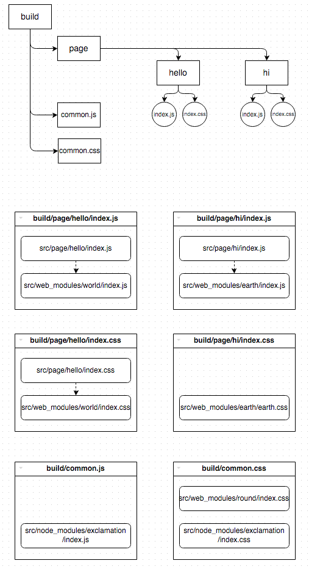

# reduce-web-component
[](https://www.npmjs.org/package/reduce-web-component)
[](https://travis-ci.org/reducejs/reduce-web-component)


Pack js and css files from web components into bundles.

**Features**

* Use [`reduce-js`] and [`reduce-css`] to pack scripts and styles into common shared bundles.
* Automatically pack styles together when their bounding scripts `require` each other.
* Use [`postcss`] to preprocess styles by default.

## Example
Create common shared bundles as well as page-specific ones.

### Input

#### Source directories

```
example/src/
├── node_modules
│   └── exclamation
│       ├── index.css
│       └── index.js
├── page
│   ├── hello
│   │   ├── index.css
│   │   └── index.js
│   └── hi
│       └── index.js
└── web_modules
    ├── earth
    │   ├── earth.css
    │   ├── index.js
    │   └── package.json
    ├── helper
    │   └── color.css
    ├── round
    │   └── index.css
    └── world
        ├── index.css
        └── index.js

```

#### Dependency graphs for JS and CSS


#### File contents

**The `hello` component**

* Script entry (page/hello/index.js)
```js
module.exports = 'hello, ' + require('world')

```

* Style entry (page/hello/index.css)
```css
.hello {}

```

**The `hi` component**

* Script entry (page/hi/index.js)
```js
module.exports = 'hi, ' + require('earth')

```

**The `world` component**

* Script entry (web_modules/world/index.js)
```js
module.exports = 'world' + require('exclamation')

```

* Style entry (web_modules/world/index.css)
```css
@external "round";
@import "helper/color";
.world {
  color: $red;
}

```

**The `earth` component**

* Script entry (web_modules/earth/index.js)
```js
module.exports = 'earth' + require('exclamation')

```

* Style entry (web_modules/earth/earth.css)
```css
@external "round";
@import "helper/color";
.earth {
  color: $blue;
}

```

**The `round` component**

* Style entry (web_modules/round/index.css)
```css
.round {}

```

**The `exclamation` component**

* Script entry (node_modules/exclamation/index.js)
```js
module.exports = '!'

```

* Style entry (node_modules/exclamation/index.css)
```css
.exclamation {}

```

### Output

#### Reduce scripts and styles to bundles

example/reduce.config.js:

```js
var path = require('path')
var fixtures = path.resolve.bind(path, __dirname, 'src')
var resolver = require('custom-resolve')
var promisify = require('node-promisify')
var styleResolve = promisify(resolver({
  main: 'style',
  extensions: '.css',
  moduleDirectory: ['web_modules', 'node_modules'],
}))

module.exports = {
  getStyle: function (jsFile) {
    if (jsFile.indexOf(fixtures('page') + '/') === 0) {
      return path.dirname(jsFile) + '/index.css'
    }
    var prefix = fixtures('web_modules') + '/'
    if (jsFile.indexOf(prefix) === 0) {
      return styleResolve(
        jsFile.slice(prefix.length).split('/')[0],
        { filename: jsFile }
      )
    }

    prefix = fixtures('node_modules') + '/'
    if (jsFile.indexOf(prefix) === 0) {
      return styleResolve(
        jsFile.slice(prefix.length).split('/')[0],
        { filename: jsFile }
      )
    }
  },

  basedir: fixtures(),
  paths: [fixtures('web_modules')],

  on: {
    log: console.log.bind(console),
    error: function (err) {
      console.log(err.stack)
    },
  },

  js: {
    entries: 'page/**/*.js',
    bundleOptions: {
      groups: '**/page/**/index.js',
      common: 'common.js',
    },
    dest: 'build',
  },

  css: {
    atRuleName: 'external',
    bundleOptions: {
      groups: '**/page/**/index.css',
      common: 'common.css',
    },
    resolve: styleResolve,
    dest: 'build',
  },
}

```

example/gulpfile.js:

```js
var gulp = require('gulp')
var reduce = require('..')

var bundler = reduce(require('./reduce.config'))

gulp.task('clean', function () {
  var del = require('del')
  return del('build')
})

gulp.task('build', ['clean'], bundler)
gulp.task('watch', ['clean'], function (cb) {
  bundler.watch().on('close', cb)
})


```

#### Dependency graph for components

We declare that
directories in `node_modules`, `page`, `web_modules`
should be treated as web components,
i.e.,
they may carry styles as well as scripts,
by specifying entries through `style` and `main` fields in the `package.json`,
and whenever the script entry of some component `require`s the entry of another component,
its style entry implicitly depends on the style entry of the latter.


#### Production directories

```
example/build/
├── common.css
├── common.js
└── page
    ├── hello
    │   ├── index.css
    │   └── index.js
    └── hi
        ├── index.css
        └── index.js

```

#### Bundle contents




## Usage

```js
var reduce = require('reduce-web-component')

var bundler = reduce(options)

// pack
bundler().then(function () {})

// watch mode
bundler.watch()

```

### options

#### js
Specify how to pack javascript modules.

Type: `Object`

`js.entries`: `String`, `Array`.
Globs to locate script entries to components.
It is passed to [`reduce-js`] as the first argument.

`js.postTransform`: `Array`.
A list of [`gulp`]-plugins to transform the created [`vinyl`] file objects.

`js.dest`:
`[reduce.dest].concat(js.dest)` will be appended to `js.postTransform` to write files into the disk.

`js.reduce`: `Object`.
Options passed to [`reduce-js`] as the second argument.

`js.on`: `Object`.
A group of event listeners to be added to the instance of [`reduce-js`].
Usually you can handle the `error` and `log` events here.

**NOTE**
All other fields will be assigned to `js.reduce`,
for the sake of the convenience of setting `js.reduce`.

#### css
Specify how to pack style modules.

Type: `Object`

`css.entries`: `String`, `Array`.
Globs to locate script entries to components.
It is passed to [`reduce-css`] as the first argument.

`css.postTransform`: `Array`.
A list of [`gulp`]-plugins to transform the created [`vinyl`] file objects.

`css.dest`:
`[reduce.dest].concat(css.dest)` will be appended to `css.postTransform` to write files into the disk.

`css.reduce`: `Object`.
Options passed to [`reduce-css`] as the second argument.

`css.postcss`: `String`, `Array`, `Function`.
If not `false`, [`postcss`] will be enabled to preprocess styles before packing.
And this option can be used to modify the plugins used by [`postcss`].
It has the same meaning with [`reduce-css-postcss#processorFilter`].
Check [`reduce-css-postcss`] to see the list of default plugins.

`css.on`: `Object`.
A group of event listeners to be added to the instance of [`reduce-css`].
Usually you can handle the `error` and `log` events here.

**NOTE**
All other fields will be assigned to `css.reduce`,
for the sake of the convenience of setting `css.reduce`.

#### getStyle
Specify how to add implicit dependencies to styles.

Type: `Function`

Signature: `cssFiles = getStyle(jsFile)`

`cssFiles` could be `String`, `Array` or `Promise`.

If `cssFiles` is not empty,
`jsFile` has some bounded styles,
which means:

* when a script module with bounded styles `require`s `jsFile`, its bounded styles will depend on `cssFiles` implicitly.
* when `jsFile` `require`s another script module with bounded styles, `cssFiles` will depend on those styles implicitly.

## Related
* [`reduce-js`]
* [`reduce-css`]

[`reduce-js`]: https://github.com/zoubin/reduce-js
[`reduce-css`]: https://github.com/zoubin/reduce-css
[`gulp`]: https://github.com/gulpjs/gulp
[`vinyl`]: https://github.com/gulpjs/vinyl
[`postcss`]: https://github.com/postcss/postcss
[`reduce-css-postcss#processorFilter`]: https://github.com/zoubin/reduce-css-postcss#processorfilter
[`reduce-css-postcss`]: https://github.com/zoubin/reduce-css-postcss#default-plugins

