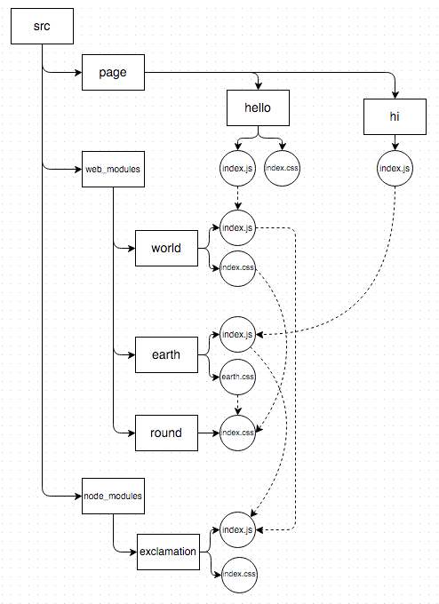
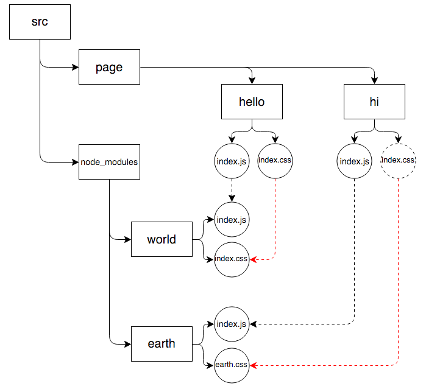

# reduce-web-component
[](https://www.npmjs.org/package/reduce-web-component)
[](https://travis-ci.org/reducejs/reduce-web-component)
[](https://coveralls.io/github/reducejs/reduce-web-component)
[](https://david-dm.org/reducejs/reduce-web-component)
[](https://david-dm.org/reducejs/reduce-web-component#info=devDependencies)


**Features**

* Automatically pack styles together when one component requires another (in scripts).
* Use [`browserify`] and [`depsify`] to pack scripts and styles into common shared bundles.
* Use [`watchify2`] to watch file changes, addition and deletion.
* Use [`postcss`] to preprocess styles by default.

## Example
Suppose we put pages under the directory `/path/to/src/page`,
and other components under `/path/to/src/node_modules`.

Pages and components may have a style entry as well as a script entry.
For simplicity, entries are named as `index.[js|css]` if present.

There are two pages (`hello` and `hi`), as well as two components (`world`, `earth`).

The `hello` page will present the `world` component (both scripts and styles needed).
We can do this by adding `require('world')` in `hello/index.js`,
and `@import "world";` in `hello/index.css`.
However, if `world` is no longer needed,
we have to remove both `require('world')` and `@import "world"`,
which is really cumbersome.

So, we decide that if the script entry is `require`d,
the corresponding style entry should also be `@import`ed.
In such cases, we say the component is required.
The magic to be made here,
is adding style dependencies according to script dependencies.

Eventually, we want scripts required by all pages to be packed into `/path/to/build/bundle.js`,
and styles into `/path/to/build/bundle.css`.

We can use this package to make it.

### Input

**The `hello` page**

* Script entry (`page/hello/index.js`)
```js
module.exports = 'hello, ' + require('world')

```

* Style entry (`page/hello/index.css`)
```css
.hello {}

```

**The `hi` component**

* Script entry (`page/hi/index.js`)
```js
module.exports = 'hi, ' + require('earth')

```

* Style entry (`null`)

**The `world` component**

* Script entry (`node_modules/world/index.js`)
```js
module.exports = 'world'

```

* Style entry (`node_modules/world/index.css`)
```css
.world {
  color: red;
}

```

**The `earth` component**

* Script entry (`node_modules/earth/index.js`)
```js
module.exports = 'earth'

```

* Style entry (`node_modules/earth/index.css`)
```css
.earth {
  color: blue;
}

```

The original dependency graph looks like:



The dependency graph we want for bundling should look like:



**NOTE**
As `hi` requires `earth` and `earth` is shipped with styles,
`hi` will need styles at last.
So a virtual `hi/index.css` is created (but not written into disk).

### Output

We run the following script to bundle js and css:

```js
'use strict'

const path = require('path')
const reduce = require('reduce-web-component')

const options = {
  getStyle: function (jsFile) {
    return path.dirname(jsFile) + '/index.css'
  },

  reduce: {
    basedir: path.resolve(__dirname, 'src'),
  },

  on: {
    log: console.log.bind(console),
    error: function (err) {
      console.error(err.stack)
    },
    'reduce.end': function (bytes, duration) {
      console.log(
        '[%s done] %d bytes written (%d seconds)',
        this._type, bytes, (duration / 1000).toFixed(2)
      )
    },
  },

  js: {
    entries: 'page/**/index.js',
    bundleOptions: 'bundle.js',
    dest: 'build',
  },

  css: {
    // No need to specify entries,
    // because we have done that implicitly by setting getStyle.
    // entries: 'page/**/index.css',
    bundleOptions: 'bundle.css',
    dest: 'build',
  },
}

reduce.bundle(options).then(() => console.log('DONE'))


```

Besides `hello/index.css` and `world/index.css`,
`earth/index.css` will also be included in `bundle.css`.

## Usage

```js
const reduce = require('reduce-web-component')

// pack
reduce.bundle(options).then(() => {})

// watch mode
reduce.watch(options).on('done', () => {})

```

To work with [`gulp`]:

```js
const gulp = require('gulp')
const reduce = require('reduce-web-component')

gulp.task('build', () => {
  return reduce.bundle(options)
})
gulp.task('watch', function (cb) {
  reduce.watch(options)
    .on('close', cb)
    .on('done', () => console.log('-'.repeat(40)))
})

```

## Common shared bundles
Check the [configure](example/multi/reduce.config.js) file.

## Browserify
Scripts are bundled with [`browserify`].
So, plugins and transforms can be applied during the build process.

Check [`browserify-handbook`] for more information.

## PostCss
Styles are preprocessed with [`postcss`].
Check [`reduce-css-postcss`] to see the default processors.

[`depsify`] is used to bundle styles,
so that styles can be packed into common shared multiple bundles.

## options

* `js`: options for packing js
* `css`: options for packing css
* `reduce`: common options for both js and css. Actually, this object will be merged into `options.js.reduce` and `options.css.reduce`.
* `on`: listeners for both js and css. Merged into `options.js.on` and `options.css.on`.
* `getStyle`: binding JS and CSS together so that when js is required, the corresponding css will also be imported by the dependant's css.
* `watch`: options for [`watchify2`].

### options.js and options.css
These two objects share the following fields.

**reduce**

*Optional*

Type: `Object`

Passed to [`browserify`] or [`depsify`] as options.

Do not specify the `reduce.entries` as globs.
Use the following `entries` option instead.

**entries**

*Optional*

Type: `String`, `Array`

Globs to locate entries.
Passed to [`vinyl-fs#src`] as the first argument,
with the second argument `{ cwd: b._options.basedir }`.

**plugin**

*Optional*

Type: `Array`

A list of [`gulp`] plugins to process `b.bundle()`.

Each element is an array containing the constructor with its arguments to create the transform.
If the first element is `'dest'`, `reduce.dest` is used as the constructor,
where `reduce` could be either `require('reduce-js')` or `require('reduce-css')`.

```js
{
  js: {
    plugin: [
      [require('gulp-uglify')],
      ['dest', 'build'],
    ],
  }
}

```

**dest**

*Optional*

Type: `String`, `Array`

Arguments passed to `reduce.dest`,
which writes files to disk.

This is just a shortcut for adding in the `plugin` option the `reduce.dest`, as the last transform for `b.bundle()`.

**bundleOptions**

Options passed to [`common-bundle`].

**on**

Type: `Object`

*Optional*

Specify listeners to be attached on the [`browserify`] or [`depsify`] instance.

```js
{
  js: {
    on: {
      error: console.log.bind(console),
      log: console.log.bind(console),
    },
  }
}

```

**postcss**

Only valid for css.

If not `false`, [`postcss`] will be applied to preprocess css.
And this option can be used to specify the postcss plugins.
By default, plugins from [`reduce-css-postcss`] are applied.

### options.reduce
Options merged into both `options.js.reduce` and `options.css.reduce`.

```js
{
  reduce: {
    basedir: __dirname,
  },
  js: {
    reduce: {
      paths: [__dirname + '/scripts'],
    },
  },
  css: {
    reduce: {
      paths: [__dirname + '/styles'],
    },
  }
}

```

### options.on
Listeners merged into both `options.js.on` and `options.css.on`.

```js
{
  on: {
    log: console.log.bind(console),
    error: function (err) {
      console.log(err.stack)
    },
    'reduce.end': function (bytes, duration) {
      let b = this
      console.log(
        '[%s done] %d bytes written (%d seconds)',
        b._type.toUpperCase(), bytes, (duration / 1000).toFixed(2)
      )
    },
  },
  js: {
    on: {
      'common.map': function (map) {
        console.log('[JS bundles] %s', Object.keys(map).join(', '))
      },
    },
  },
  css: {
    on: {
      'common.map': function (map) {
        console.log('[CSS bundles] %s', Object.keys(map).join(', '))
      },
    },
  }

}

```

### options.map
Type: `String`, `Object`

map or map.file: specify the dependence map file path which will be generated after each bundle.

map.basedir: specify the base directory of relative paths in dependence map. Default is process.cwd().

**Events**

* `.on('log', msg => {})`. Messages from plugins.
* `.on('error', err => {})`.
* `.on('common.map', (bundleMap, inputMap) => {})`.
Check [here](https://github.com/reducejs/common-bundle#boncommonmap-bundlemap-inputmap--) for more information.
* `.on('reduce.end', (bytes, duration) => {})`. Information on bundling.
* All other events emitted on the [`browserify`] and [`depsify`] instance.

### options.getStyle
Specify how to add implicit dependencies to styles.
If not specified, js and css will pack independently.

Type: `Function`

*Optional*

Signature: `cssFiles = getStyle(jsFile)`

`cssFiles` could be `String`, `Array` or `Promise`.

If `cssFiles` is not empty, `jsFile` has some bound styles,
which means:

* when a script module with bound styles `require`s `jsFile`, its styles will depend on `cssFiles` implicitly.
* when `jsFile` `require`s another script with bound styles, `cssFiles` will depend on those styles implicitly.

```js
{
  getStyle: function (jsFile) {
    if (jsFile.indexOf('/path/to/src/component/') === 0) {
      // bind index.js and index.css together
      // If `component/A/index.js` requires `component/B/index.js`,
      // then `component/B/index.css` will always be packed into bundles
      // containing `component/A/index.css`
      // (or in the common bundle they share).
      return path.dirname(jsFile) + '/index.css'
    }
  },
}

```

### options.watch

`options.watch.js` and `options.watch.css` are passed to [`watchify2`]
to watch JS and CSS file changes.

```js
{
  watch: {
    js: {
      // rebundle when entries are added or removed
      entryGlob: 'page/**/index.js',
      // do not watch files under node_modules
      ignoreWatch: true,
    },
    css: {
      // rebundle when entries are added or removed
      entryGlob: 'page/**/index.css',
      // do not watch files under node_modules
      ignoreWatch: true,
    },
  },
}

```

## Related
* [`reduce-js`]
* [`reduce-css`]

[`reduce-js`]: https://github.com/reducejs/reduce-js
[`browserify`]: https://github.com/substack/node-browserify
[`browserify-handbook`]: https://github.com/substack/browserify-handbook
[`depsify`]: https://github.com/reducejs/depsify
[`common-bundle`]: https://github.com/reducejs/common-bundle
[`watchify2`]: https://github.com/reducejs/watchify2
[`reduce-css`]: https://github.com/reducejs/reduce-css
[`gulp`]: https://github.com/gulpjs/gulp
[`vinyl`]: https://github.com/gulpjs/vinyl
[`vinyl-fs#src`]: https://github.com/gulpjs/vinyl-fs#srcglobs-options
[`postcss`]: https://github.com/postcss/postcss
[`reduce-css-postcss`]: https://github.com/reducejs/reduce-css-postcss#default-plugins
[`custom-resolve`]: https://github.com/zoubin/custom-resolve

