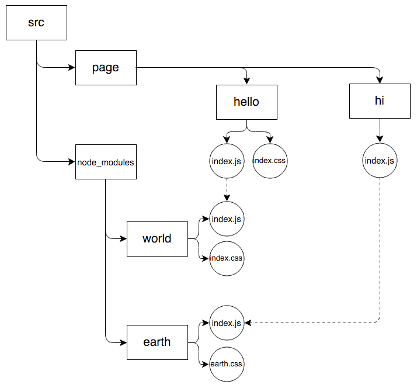

# reduce-web-component
[](https://www.npmjs.org/package/reduce-web-component)
[](https://travis-ci.org/reducejs/reduce-web-component)


Pack js and css files from web components into bundles.

**Features**

* Use [`reduce-js`] and [`reduce-css`] to pack scripts and styles into common shared bundles.
* Automatically pack styles together when their binding scripts `require` each other.
* Use [`postcss`] to preprocess styles by default.

## Example
Create common shared bundles as well as page-specific ones.

### Input

#### Source directories

```
example/src/
├── node_modules
│   └── exclamation
│       ├── index.css
│       └── index.js
├── page
│   ├── hello
│   │   ├── index.css
│   │   └── index.js
│   └── hi
│       └── index.js
└── web_modules
    ├── earth
    │   ├── earth.css
    │   ├── index.js
    │   └── package.json
    ├── helper
    │   └── color.css
    ├── round
    │   └── index.css
    └── world
        ├── index.css
        └── index.js

```

#### Dependency graphs for JS and CSS



#### File contents

**The `hello` component**

* Script entry (page/hello/index.js)
```js
module.exports = 'hello, ' + require('world')

```

* Style entry (page/hello/index.css)
```css
.hello {}

```

**The `hi` component**

* Script entry (page/hi/index.js)
```js
module.exports = 'hi, ' + require('earth')

```

**The `world` component**

* Script entry (web_modules/world/index.js)
```js
module.exports = 'world' + require('exclamation')

```

* Style entry (web_modules/world/index.css)
```css
@external "round";
@import "helper/color";
.world {
  color: $red;
}

```

**The `earth` component**

* Script entry (web_modules/earth/index.js)
```js
module.exports = 'earth' + require('exclamation')

```

* Style entry (web_modules/earth/earth.css)
```css
@external "round";
@import "helper/color";
.earth {
  color: $blue;
}

```

**The `round` component**

* Style entry (web_modules/round/index.css)
```css
.round {}

```

**The `exclamation` component**

* Script entry (node_modules/exclamation/index.js)
```js
module.exports = '!'

```

* Style entry (node_modules/exclamation/index.css)
```css
.exclamation {}

```

### Output

#### Reduce scripts and styles to bundles

[example/reduce.config.js](example/reduce.config.js)

example/gulpfile.js:

```js
var gulp = require('gulp')
var reduce = require('reduce-web-component')

var bundler = reduce(require('./reduce.config'))

gulp.task('clean', function () {
  var del = require('del')
  return del('build')
})

gulp.task('build', ['clean'], bundler)
gulp.task('watch', ['clean'], function (cb) {
  bundler.watch()
    .on('close', cb)
    .on('done', () => console.log('-'.repeat(80)))
})

```

#### Dependency graph for components

We declare that
directories in `node_modules`, `page`, `web_modules`
should be treated as web components,
i.e.,
they may carry styles as well as scripts,
by specifying entries through `style` and `main` fields in the `package.json`,
and whenever the script entry of some component `require`s the entry of another component,
its style entry implicitly depends on the style entry of the latter.


#### Production directories

```
example/build/
├── common.css
├── common.js
└── page
    ├── hello
    │   ├── index.css
    │   └── index.js
    └── hi
        ├── index.css
        └── index.js

```

#### Bundle contents


## Usage

```js
var reduce = require('reduce-web-component')

var bundler = reduce(options)

// pack
bundler().then(function () {})

// watch mode
bundler.watch()

```

### options

* `js`: options for packing js
* `css`: options for packing css
* `reduce`: common options for both js and css. Actually, this object will be merged into `options.js.reduce` and `options.css.reduce`.
* `on`: listeners for both js and css. Merged into `options.js.on` and `options.css.on`.
* `getStyle`: binding JS and CSS together so that when js is required, the corresponding css will also be imported by the dependant's css.
* `watch`: options for [`watchify2`].

#### options.js and options.css
These two objects share the following fields.

**reduce**

*Optional*

Type: `Object`

Passed to [`browserify`] or [`depsify`] as options.

Do not specify the `reduce.entries` as globs.
Use the following `entries` option instead.

**entries**

*Optional*

Type: `String`, `Array`

Globs to locate entries.
Passed to [`vinyl-fs#src`] as the first argument,
with the second argument `{ cwd: b._options.basedir }`.

**postTransform**

*Optional*

Type: `Array`

A list of lazy streams to transform `b.bundle()`.
Each element is an array containing the constructor with its arguments to create the transform.
The first element can also be `'dest'`.
If so, `reduce.dest` is used as the constructor,
where `reduce` could be either `require('reduce-js')` or `require('reduce-css')`.

```js
{
  js: {
    postTransform: [
      [require('gulp-uglify')],
      ['dest', 'build'],
    ],
  }
}

```

**dest**

*Optional*

Type: `String`, `Array`

Arguments passed to `reduce.dest`,
which writes files to disk.

This is just a shortcut for adding in the `postTransform` option the `reduce.dest`, as the last transform for `b.bundle()`.

**bundleOptions**

Options passed to [`common-bundle`].

**on**

Type: `Object`

*Optional*

Specify listeners to be attached on the [`browserify`] or [`depsify`] instance.

```js
{
  js: {
    on: {
      error: console.log.bind(console),
      log: console.log.bind(console),
    },
  }
}

```

#### options.reduce
Options merged into both `options.js.reduce` and `options.css.reduce`.

```js
{
  reduce: {
    basedir: __dirname,
  },
  js: {
    reduce: {
      paths: [__dirname + '/scripts'],
    },
  },
  css: {
    reduce: {
      paths: [__dirname + '/styles'],
    },
  }
}

```

**postcss**

Only valid for css.
Probably should be specified by `options.css.reduce.postcss`.

If not `false`, [`postcss`] will be applied to preprocess css.
And this option can be used to specify the postcss plugins.
By default, plugins from [`reduce-css-postcss`] are applied.

`options.css.postcss` specifies the `processorFilter` option for [`reduce-css-postcss`].

#### options.on
Listeners merged into both `options.js.on` and `options.css.on`.

```js
{
  on: {
    log: console.log.bind(console),
    error: function (err) {
      console.log(err.stack)
    },
    'reduce.end': function (bytes, duration) {
      let b = this
      console.log(
        '[%s done] %d bytes written (%d seconds)',
        b._type.toUpperCase(), bytes, (duration / 1000).toFixed(2)
      )
    },
  },
  js: {
    on: {
      'common.map': function (map) {
        console.log('[JS bundles] %s', Object.keys(map).join(', '))
      },
    },
  },
  css: {
    on: {
      'common.map': function (map) {
        console.log('[CSS bundles] %s', Object.keys(map).join(', '))
      },
    },
  }

}

```

**Events**

* `.on('log', msg => {})`. Messages from plugins.
* `.on('error', err => {})`.
* `.on('common.map', map => {})`. The bundle map info from [`common-bundle`].
* `.on('reduce.end', (bytes, duration) => {})`. Information  on bundles created and time consumed.
* All other events emitted on the [`browserify`] and [`depsify`] instance.

#### options.getStyle
Specify how to add implicit dependencies to styles.
If not specified, js and css will pack independently.

Type: `Function`

*Optional*

Signature: `cssFiles = getStyle(jsFile)`

`cssFiles` could be `String`, `Array` or `Promise`.

If `cssFiles` is not empty, `jsFile` has some bound styles,
which means:

* when a script module with bound styles `require`s `jsFile`, its styles will depend on `cssFiles` implicitly.
* when `jsFile` `require`s another script with bound styles, `cssFiles` will depend on those styles implicitly.

```js
{
  getStyle: function (jsFile) {
    if (jsFile.indexOf('/path/to/src/component/') === 0) {
      // bind index.js and index.css together
      // If `component/A/index.js` requires `component/B/index.js`,
      // then `component/B/index.css` will always be packed into the bundle containing `component/A/index.css`
      // (or in the common bundle it shares with other bundles).
      return path.dirname(jsFile) + '/index.css'
    }
  },
}

```

## Related
* [`reduce-js`]
* [`reduce-css`]

[`reduce-js`]: https://github.com/reducejs/reduce-js
[`browserify`]: https://github.com/substack/node-browserify
[`depsify`]: https://github.com/reducejs/depsify
[`reduce-css`]: https://github.com/reducejs/reduce-css
[`gulp`]: https://github.com/gulpjs/gulp
[`vinyl`]: https://github.com/gulpjs/vinyl
[`vinyl-fs#src`]: https://github.com/gulpjs/vinyl-fs#srcglobs-options
[`postcss`]: https://github.com/postcss/postcss
[`reduce-css-postcss`]: https://github.com/reducejs/reduce-css-postcss#default-plugins
[`custom-resolve`]: https://github.com/zoubin/custom-resolve

